# 🚀 CI/CD Performance Guardrails - Complete Guide

**BISMAN ERP - Continuous Performance Monitoring**

---

## 📋 Table of Contents

1. [Overview](#overview)
2. [Pipeline Architecture](#pipeline-architecture)
3. [Setup Instructions](#setup-instructions)
4. [Performance Gates](#performance-gates)
5. [Configuration Files](#configuration-files)
6. [Slack Notifications](#slack-notifications)
7. [Monthly Audit Reports](#monthly-audit-reports)
8. [Troubleshooting](#troubleshooting)
9. [Example Reports](#example-reports)

---

## Overview

This CI/CD pipeline ensures **every deployment maintains or improves speed and space efficiency** through automated performance gates.

### Key Features

✅ **Lighthouse CI** - Frontend performance testing (LCP, TTI, CLS)  
✅ **Bundle Analysis** - Automatic size comparison, fail on >20% increase  
✅ **API Performance** - Artillery load testing with 700ms latency threshold  
✅ **Database Health** - Size, bloat, and index usage checks  
✅ **Storage Validation** - Cleanup checks for uploads/logs/temp  
✅ **Docker Optimization** - Multi-stage builds with caching  
✅ **Slack Alerts** - Real-time regression notifications  
✅ **Monthly Audits** - Automated comprehensive reports  

---

## Pipeline Architecture

```mermaid
graph TB
    A[Code Push/PR] --> B[Setup & Build]
    B --> C[Bundle Analysis]
    B --> D[Lighthouse CI]
    B --> E[API Performance]
    B --> F[Database Health]
    B --> G[Storage Check]
    B --> H[Docker Build]
    
    C --> I[Notifications]
    D --> I
    E --> I
    F --> I
    G --> I
    H --> I
    
    I --> J{All Pass?}
    J -->|Yes| K[✅ Deploy]
    J -->|No| L[❌ Block & Alert]
```



### Pipeline Jobs

| Job | Duration | Purpose | Fail Criteria |
|-----|----------|---------|---------------|
| **Setup & Build** | ~5 min | Build frontend/backend, cache deps | Build errors |
| **Bundle Analysis** | ~2 min | Compare bundle sizes | >20% increase |
| **Lighthouse CI** | ~10 min | Test Core Web Vitals | LCP>2.5s, TTI>3s, CLS>0.1 |
| **API Performance** | ~8 min | Load test with Artillery | P95>700ms, errors>5% |
| **Database Health** | ~3 min | Check size, bloat, indexes | Size>5GB, bloat>20% |
| **Storage Check** | ~1 min | Validate cleanup policies | Usage>90%, old files>100 |
| **Docker Build** | ~10 min | Multi-stage optimized build | Image size monitoring |
| **Notifications** | ~1 min | Send alerts to Slack | - |

**Total Pipeline Time:** ~15-20 minutes

---

## Setup Instructions

### 1. GitHub Repository Setup

#### Step 1: Add Workflow File

The workflow is already created at:
```
.github/workflows/performance-ci.yml
```

#### Step 2: Configure Secrets

Go to **Settings → Secrets and variables → Actions** and add:

| Secret Name | Description | Required |
|-------------|-------------|----------|
| `SLACK_WEBHOOK_URL` | Slack incoming webhook URL | Recommended |
| `DOCKER_USERNAME` | Docker Hub username | Optional |
| `DOCKER_PASSWORD` | Docker Hub password | Optional |
| `LHCI_GITHUB_TOKEN` | GitHub token for Lighthouse CI | Optional |

**Get Slack Webhook URL:**
```bash
# 1. Go to https://api.slack.com/apps
# 2. Create new app → From scratch
# 3. Enable "Incoming Webhooks"
# 4. Create webhook for your channel
# 5. Copy webhook URL to GitHub secrets
```

#### Step 3: Enable GitHub Actions

```bash
# In your repository settings:
# Settings → Actions → General
# ✅ Allow all actions and reusable workflows
```

### 2. Frontend Configuration

#### Enable Bundle Analyzer

Add to `my-frontend/package.json`:

```json
{
  "scripts": {
    "analyze": "ANALYZE=true npm run build",
    "build": "next build"
  },
  "devDependencies": {
    "@next/bundle-analyzer": "^14.0.0"
  }
}
```

Add to `my-frontend/next.config.js`:

```javascript
const withBundleAnalyzer = require('@next/bundle-analyzer')({
  enabled: process.env.ANALYZE === 'true',
});

module.exports = withBundleAnalyzer({
  // ... your existing config
});
```

### 3. Backend Configuration

#### Install Artillery (for local testing)

```bash
npm install -g artillery@latest
```

#### Test Artillery Configuration

```bash
# Test API performance locally
artillery run artillery-config.yml
```

### 4. Docker Setup

#### Build Optimized Images

```bash
# Build backend
docker build -f Dockerfile.optimized --target backend-runner -t bisman-erp-backend .

# Build frontend
docker build -f Dockerfile.optimized --target frontend-runner -t bisman-erp-frontend .

# Check image sizes
docker images | grep bisman-erp
```

#### Run with Docker Compose

```bash
# Start all services
docker-compose -f docker-compose.ci.yml up -d

# View logs
docker-compose -f docker-compose.ci.yml logs -f

# Stop services
docker-compose -f docker-compose.ci.yml down
```

---

## Performance Gates

### 1. Bundle Analysis Gate

**Threshold:** Maximum 20% size increase

**Check Process:**
```javascript
// Compares current build with previous commit
const sizeIncrease = ((currentSize - previousSize) / previousSize) * 100;

if (sizeIncrease > 20) {
  fail('Bundle size increased by ' + sizeIncrease + '%');
}
```

**What Triggers Failure:**
- Adding large dependencies
- Importing entire libraries instead of tree-shaking
- Duplicating code across chunks
- Not using dynamic imports

**How to Fix:**
```bash
# Analyze bundle locally
cd my-frontend
ANALYZE=true npm run build

# Review .next/analyze/client.html
# Identify large dependencies
# Use dynamic imports for heavy components
```

### 2. Lighthouse CI Gate

**Thresholds:**

| Metric | Target | Fail Threshold |
|--------|--------|----------------|
| **Performance Score** | 80+ | <80 |
| **Accessibility Score** | 90+ | <90 |
| **LCP** | <2.5s | >2.5s |
| **FID** | <100ms | >100ms |
| **CLS** | <0.1 | >0.1 |
| **TTI** | <3s | >3s |
| **TBT** | <300ms | >300ms |

**What Triggers Failure:**
- Large images without optimization
- Render-blocking resources
- Too much JavaScript on initial load
- Layout shifts during load
- Long main thread tasks

**How to Fix:**
```bash
# Run Lighthouse locally
lighthouse http://localhost:3000/super-admin --view

# Common fixes:
# 1. Optimize images (use next/image)
# 2. Code splitting (dynamic imports)
# 3. Defer non-critical CSS
# 4. Use font-display: swap
# 5. Minimize layout shifts
```

### 3. API Performance Gate

**Thresholds:**

| Metric | Target | Fail Threshold |
|--------|--------|----------------|
| **P95 Latency** | <500ms | >700ms |
| **P99 Latency** | <800ms | >1000ms |
| **Error Rate** | <1% | >5% |
| **Throughput** | >100 req/s | - |

**Load Test Profile:**
```yaml
Phase 1: Ramp to 50 users (30s)
Phase 2: Sustain 100 users (60s)
Phase 3: Spike to 200 users (30s)
Phase 4: Sustain 200 users (60s)
Phase 5: Peak at 500 users (30s)
Phase 6: Ramp down (30s)
```

**What Triggers Failure:**
- Inefficient database queries
- Missing indexes
- No caching layer
- Synchronous blocking operations
- Memory leaks

**How to Fix:**
```bash
# Profile slow endpoints
cd my-backend
npm run dev

# Add logging to identify slow queries
# Use the cache service (cacheService.js)
# Add database indexes
# Use connection pooling
```

### 4. Database Health Gate

**Thresholds:**

| Check | Warning | Critical |
|-------|---------|----------|
| **Database Size** | >1GB | >5GB |
| **Table Bloat** | >10% | >20% |
| **Unused Indexes** | >5 | >10 |
| **Cache Hit Ratio** | <80% | <60% |

**What Triggers Failure:**
- Database size exceeds 5GB
- More than 10 unused indexes
- Cache hit ratio below 60%
- Table bloat above 20%

**How to Fix:**
```bash
# Connect to database
psql -U postgres -d bisman_erp

# Check table sizes
SELECT schemaname, tablename, pg_size_pretty(pg_total_relation_size(schemaname||'.'||tablename))
FROM pg_tables
ORDER BY pg_total_relation_size(schemaname||'.'||tablename) DESC;

# Find unused indexes
SELECT schemaname, tablename, indexname
FROM pg_stat_user_indexes
WHERE idx_scan = 0;

# Vacuum bloated tables
VACUUM ANALYZE table_name;

# Drop unused indexes
DROP INDEX index_name;
```

### 5. Storage Check Gate

**Thresholds:**

| Directory | Warning | Critical |
|-----------|---------|----------|
| `/uploads` | >500MB | >1GB |
| `/logs` | >50MB | >100MB |
| `/tmp` | >100MB | >200MB |
| **Old Files** | >50 | >100 |

**What Triggers Failure:**
- Uploads directory >1GB
- Logs directory >100MB
- More than 100 files older than 30 days
- Temp directory >200MB

**How to Fix:**
```bash
# Run cleanup script
./cleanup-storage.sh

# Setup automated cleanup cron
crontab -e
0 2 * * * cd /path/to/erp && ./cleanup-storage.sh

# Manual cleanup
find my-backend/uploads -type f -mtime +30 -delete
find my-backend/logs -type f -mtime +7 -delete
find my-backend/tmp -type f -mtime +1 -delete
```

---

## Configuration Files

### 1. GitHub Actions Workflow

**File:** `.github/workflows/performance-ci.yml`

**Triggers:**
- Push to `main`, `under-development`, `staging`
- Pull requests to these branches
- Monthly schedule (1st day of month at 2 AM)
- Manual dispatch

**Key Environment Variables:**
```yaml
NODE_VERSION: '18'
MAX_BUNDLE_INCREASE: '20'  # Percentage
MAX_API_LATENCY: '700'     # Milliseconds
STORAGE_QUOTA_THRESHOLD: '90'  # Percentage
```

### 2. Lighthouse Configuration

**File:** `lighthouserc.json`

**Key Settings:**
```json
{
  "assert": {
    "assertions": {
      "largest-contentful-paint": ["error", {"maxNumericValue": 2500}],
      "interactive": ["error", {"maxNumericValue": 3000}],
      "cumulative-layout-shift": ["error", {"maxNumericValue": 0.1}]
    }
  }
}
```

### 3. Lighthouse Budget

**File:** `lighthouse-budget.json`

**Key Budgets:**
```json
{
  "budgets": [
    {
      "resourceSizes": [
        {"resourceType": "script", "budget": 400},
        {"resourceType": "total", "budget": 5120},
        {"resourceType": "stylesheet", "budget": 150}
      ]
    }
  ]
}
```

### 4. Docker Configuration

**File:** `Dockerfile.optimized`

**Features:**
- ✅ Multi-stage build (6 stages)
- ✅ Alpine Linux base (~5MB)
- ✅ Production dependencies only
- ✅ Non-root user
- ✅ Health checks
- ✅ Layer caching optimization

**Expected Image Sizes:**
- Backend: 150-200MB
- Frontend: 200-300MB

---

## Slack Notifications

### Setup Slack Integration

#### 1. Create Slack App

```
1. Go to https://api.slack.com/apps
2. Click "Create New App"
3. Select "From scratch"
4. Name: "BISMAN ERP CI/CD"
5. Select your workspace
```

#### 2. Enable Incoming Webhooks

```
1. In app settings → "Incoming Webhooks"
2. Toggle "Activate Incoming Webhooks" ON
3. Click "Add New Webhook to Workspace"
4. Select channel (e.g., #erp-alerts)
5. Copy webhook URL
```

#### 3. Add to GitHub Secrets

```
1. Go to GitHub repo → Settings → Secrets
2. Click "New repository secret"
3. Name: SLACK_WEBHOOK_URL
4. Value: [paste webhook URL]
5. Click "Add secret"
```

### Notification Types

#### 1. Failure Alert (Critical)

```json
{
  "text": "🚨 Performance Regression Detected",
  "blocks": [
    {
      "type": "header",
      "text": "🚨 Performance CI/CD Failed"
    },
    {
      "type": "section",
      "fields": [
        "Repository: bisman-ERP-Building",
        "Branch: under-development",
        "Failed Checks: ❌ Bundle Analysis, ❌ API Performance"
      ]
    },
    {
      "type": "actions",
      "elements": [
        {
          "type": "button",
          "text": "View Workflow",
          "url": "https://github.com/..."
        }
      ]
    }
  ]
}
```

#### 2. Monthly Audit Success

```json
{
  "text": "✅ Monthly Performance Audit Complete",
  "blocks": [
    {
      "type": "header",
      "text": "✅ Monthly Audit - All Checks Passed"
    },
    {
      "type": "section",
      "text": "All performance checks passed successfully! 🎉"
    }
  ]
}
```

### Custom Slack Commands (Optional)

Create slash commands for manual triggers:

```bash
# /erp-benchmark
# Triggers manual performance benchmark

# /erp-lighthouse
# Runs Lighthouse CI manually

# /erp-load-test
# Runs Artillery load test
```

---

## Monthly Audit Reports

### Automated Schedule

**Cron:** `0 2 1 * *` (1st day of month at 2 AM UTC)

**Full Test Suite:**
- ✅ Complete Lighthouse audit (all pages)
- ✅ Extended load test (30 min duration)
- ✅ Database size and bloat analysis
- ✅ Storage usage trends
- ✅ Bundle size comparison (vs previous month)
- ✅ Performance regression detection

### Report Artifacts

All reports are saved as GitHub Actions artifacts:

1. **Bundle Analysis** (`bundle-report.json`)
2. **Lighthouse Reports** (`.html` and `.json`)
3. **API Performance** (`artillery-report.html`)
4. **Database Health** (`db-health-report.json`)
5. **Storage Report** (`storage-report.json`)

**Access Artifacts:**
```
GitHub Repo → Actions → Select workflow run → Artifacts
```

### Example Monthly Report

See [Example Monthly Report](#example-monthly-report) section below.

---

## Troubleshooting

### Common Issues

#### 1. Lighthouse CI Fails

**Error:** `LCP > 2.5s threshold`

**Solution:**
```bash
# Test locally first
cd my-frontend
npm run dev

# In another terminal
lighthouse http://localhost:3000/super-admin --view

# Common fixes:
# 1. Optimize images with next/image
# 2. Add code splitting
# 3. Reduce JavaScript bundle size
# 4. Enable compression middleware
```

#### 2. Bundle Size Increase

**Error:** `Bundle increased by 25% (threshold: 20%)`

**Solution:**
```bash
# Analyze bundle
cd my-frontend
ANALYZE=true npm run build

# Open .next/analyze/client.html
# Look for:
# - Large dependencies
# - Duplicate code
# - Unnecessary imports

# Fix by:
# - Use dynamic imports
# - Import only needed functions
# - Remove unused dependencies
```

#### 3. API Performance Degradation

**Error:** `P95 latency 850ms (threshold: 700ms)`

**Solution:**
```bash
# Profile API locally
cd my-backend
NODE_ENV=production npm start

# Use artillery to find slow endpoints
artillery quick --count 100 --num 10 http://localhost:5000/api/pages

# Common fixes:
# 1. Add caching (use cacheService.js)
# 2. Optimize database queries
# 3. Add indexes
# 4. Use connection pooling
```

#### 4. Database Bloat

**Error:** `Table bloat > 20%`

**Solution:**
```bash
# Connect to database
psql -U postgres -d bisman_erp

# Vacuum specific table
VACUUM FULL ANALYZE table_name;

# Or vacuum entire database
VACUUM FULL ANALYZE;

# Check bloat reduction
SELECT 
  schemaname, tablename,
  round(100.0 * n_dead_tup / NULLIF(n_live_tup + n_dead_tup, 0), 2) as bloat_pct
FROM pg_stat_user_tables
WHERE n_dead_tup > 0
ORDER BY bloat_pct DESC;
```

#### 5. Docker Build Fails

**Error:** `Multi-stage build failed`

**Solution:**
```bash
# Build each stage separately
docker build -f Dockerfile.optimized --target base -t test-base .
docker build -f Dockerfile.optimized --target backend-deps -t test-backend-deps .
docker build -f Dockerfile.optimized --target backend-runner -t test-backend .

# Check logs
docker logs <container-id>

# Common issues:
# - Missing dependencies in package.json
# - Prisma schema issues
# - Environment variable problems
```

### Debug Mode

Enable debug logging in workflow:

```yaml
# In .github/workflows/performance-ci.yml
env:
  DEBUG: 'true'
  ACTIONS_STEP_DEBUG: 'true'
```

---

## Example Reports

### Example 1: Successful Build Report

```markdown
# 🚀 Performance CI/CD Summary

**Workflow:** Performance CI/CD Pipeline
**Run:** #123
**Commit:** abc123def
**Branch:** under-development
**Triggered by:** push
**Date:** 2025-10-24 14:30:00 UTC

---

## 📊 Results Summary

| Check | Status | Details |
|-------|--------|---------|
| Bundle Analysis | ✅ PASS | Size: 3.2MB (+5%) |
| Lighthouse CI | ✅ PASS | LCP: 1.8s, TTI: 2.1s, CLS: 0.05 |
| API Performance | ✅ PASS | P95: 420ms, Errors: 0.2% |
| Database Health | ✅ PASS | Size: 245MB, Bloat: 3% |
| Storage Check | ✅ PASS | Uploads: 120MB, Logs: 8MB |

---

## 🎯 Performance Metrics

### Frontend (Lighthouse)

| Page | Performance | LCP | TTI | CLS |
|------|-------------|-----|-----|-----|
| Home | 92 | 1.5s | 1.8s | 0.02 |
| Login | 95 | 1.2s | 1.5s | 0.01 |
| Dashboard | 88 | 2.1s | 2.5s | 0.08 |
| Super Admin | 85 | 1.8s | 2.1s | 0.05 |

**Average Performance Score:** 90/100 ✅

### Backend (Artillery)

- **Total Requests:** 12,500
- **Average Latency:** 285ms
- **P95 Latency:** 420ms ✅
- **P99 Latency:** 680ms ✅
- **Error Rate:** 0.2% ✅
- **Throughput:** 125 req/s

### Database

- **Size:** 245MB
- **Largest Table:** users (45MB)
- **Unused Indexes:** 2
- **Cache Hit Ratio:** 94%
- **Bloat:** 3%

### Bundle

- **Total Size:** 3.2MB
- **Super Admin:** 296KB
- **Main Chunk:** 1.8MB
- **Change:** +5% (within 20% threshold) ✅

---

## ✅ All Checks Passed

No performance regressions detected. Safe to deploy! 🚀
```

### Example 2: Failed Build with Issues

```markdown
# ❌ Performance CI/CD Summary - FAILED

**Workflow:** Performance CI/CD Pipeline
**Run:** #124
**Commit:** def456ghi
**Branch:** feature/new-dashboard
**Triggered by:** pull_request
**Date:** 2025-10-24 16:45:00 UTC

---

## ⚠️ Results Summary

| Check | Status | Details |
|-------|--------|---------|
| Bundle Analysis | ❌ FAIL | Size: 7.8MB (+45%) ⚠️ |
| Lighthouse CI | ❌ FAIL | LCP: 3.2s ⚠️ |
| API Performance | ✅ PASS | P95: 520ms |
| Database Health | ✅ PASS | Size: 248MB |
| Storage Check | ✅ PASS | All within limits |

---

## 🚨 Critical Issues

### 1. Bundle Size Exceeded Threshold

**Current:** 7.8MB  
**Previous:** 5.4MB  
**Increase:** 45% ❌ (threshold: 20%)

**Cause:** Added large dependencies without optimization

**Largest Additions:**
- `chart.js`: 1.2MB
- `lodash`: 850KB (should use lodash-es)
- `moment.js`: 680KB (should use date-fns)

**Action Required:**
```bash
# Replace with smaller alternatives
npm uninstall moment lodash chart.js
npm install date-fns lodash-es chart.js/auto

# Use dynamic imports
const Chart = dynamic(() => import('chart.js/auto'));
```

### 2. Lighthouse LCP Failed

**Target:** <2.5s  
**Actual:** 3.2s ❌

**Issues:**
- Large hero image (2.5MB unoptimized)
- Render-blocking CSS (dashboard.css)
- 15 synchronous script tags

**Action Required:**
```jsx
// Use next/image for optimization
import Image from 'next/image';

<Image
  src="/hero.jpg"
  width={1200}
  height={600}
  priority
  alt="Hero"
/>

// Code split heavy components
const Dashboard = dynamic(() => import('./Dashboard'), {
  loading: () => <Spinner />,
  ssr: false
});
```

---

## 📊 Detailed Metrics

### Bundle Analysis

| Page | Size | Change |
|------|------|--------|
| Super Admin | 4.2MB | +3.8MB ❌ |
| Dashboard | 2.1MB | +800KB ⚠️ |
| Login | 350KB | +50KB ✅ |
| Home | 420KB | +30KB ✅ |

### Lighthouse Scores

| Page | Perf | LCP | TTI | CLS |
|------|------|-----|-----|-----|
| Super Admin | 62 ❌ | 3.2s ❌ | 3.8s ❌ | 0.08 ✅ |
| Dashboard | 75 ⚠️ | 2.8s ⚠️ | 3.2s ❌ | 0.05 ✅ |

---

## 🔧 Required Actions

1. **Reduce bundle size** (remove/replace heavy dependencies)
2. **Optimize images** (use next/image, compress assets)
3. **Add code splitting** (dynamic imports for large components)
4. **Remove render-blocking resources** (defer non-critical CSS/JS)

**PR Status:** ❌ BLOCKED - Performance regression detected

Fix these issues before merging.
```

### Example 3: Monthly Audit Report

```markdown
# 📅 Monthly Performance Audit - October 2025

**Date:** October 1, 2025 02:00 UTC  
**Repository:** bisman-ERP-Building  
**Period:** September 1 - September 30, 2025

---

## 🎯 Executive Summary

✅ **All performance targets met**  
📈 **15% improvement in API latency**  
📉 **Bundle size reduced by 8%**  
✅ **Zero critical issues**

---

## 📊 Monthly Trends

### API Performance (30-day average)

| Metric | Sep 2025 | Aug 2025 | Change |
|--------|----------|----------|--------|
| P95 Latency | 380ms | 450ms | -15% ✅ |
| P99 Latency | 620ms | 780ms | -21% ✅ |
| Error Rate | 0.15% | 0.28% | -46% ✅ |
| Throughput | 142 req/s | 125 req/s | +14% ✅ |

### Frontend Performance (Lighthouse avg)

| Metric | Sep 2025 | Aug 2025 | Change |
|--------|----------|----------|--------|
| Performance | 91 | 87 | +4 ✅ |
| LCP | 1.6s | 2.1s | -24% ✅ |
| TTI | 2.0s | 2.6s | -23% ✅ |
| CLS | 0.04 | 0.07 | -43% ✅ |

### Bundle Sizes

| Component | Sep 2025 | Aug 2025 | Change |
|-----------|----------|----------|--------|
| Super Admin | 296KB | 320KB | -8% ✅ |
| Dashboard | 1.8MB | 1.9MB | -5% ✅ |
| Total | 3.1MB | 3.4MB | -9% ✅ |

### Database

| Metric | Sep 2025 | Aug 2025 | Change |
|--------|----------|----------|--------|
| Size | 285MB | 256MB | +11% ⚠️ |
| Bloat | 4% | 6% | -33% ✅ |
| Cache Hit Ratio | 96% | 92% | +4% ✅ |

### Storage

| Directory | Sep 2025 | Aug 2025 | Change |
|-----------|----------|----------|--------|
| Uploads | 145MB | 180MB | -19% ✅ |
| Logs | 12MB | 35MB | -66% ✅ |
| Total | 2.3GB | 2.6GB | -12% ✅ |

---

## 🏆 Achievements

1. ✅ **Cache optimization deployed** - Improved hit rate from 85% to 96%
2. ✅ **Code splitting implemented** - Reduced Super Admin bundle by 8%
3. ✅ **Storage cleanup automated** - Logs reduced by 66%
4. ✅ **Database indexes added** - Improved P95 latency by 15%

---

## ⚠️ Areas for Improvement

1. **Database Size Growth**
   - Increased by 11% (29MB)
   - Recommend: Archive old records to cold storage
   - Timeline: Q4 2025

2. **Mobile Performance**
   - Mobile LCP: 2.3s (target: <2.0s)
   - Recommend: Optimize mobile images
   - Timeline: November 2025

---

## 🔮 Recommendations

### Short-term (Next Month)
- [ ] Implement mobile image optimization
- [ ] Add database archival process
- [ ] Review and remove unused npm packages
- [ ] Setup Redis for session management

### Long-term (Q4 2025)
- [ ] Migrate to CDN for static assets
- [ ] Implement server-side caching (Redis)
- [ ] Database partitioning for large tables
- [ ] Progressive Web App (PWA) features

---

## 📈 Performance Score

**Overall Grade: A+ (94/100)**

- Frontend Performance: A (91/100)
- Backend Performance: A+ (95/100)
- Database Health: A (92/100)
- Storage Management: A+ (98/100)

---

**Next Audit:** November 1, 2025
```

---

## Quick Reference

### Run Pipeline Manually

```bash
# Via GitHub UI
GitHub → Actions → Performance CI/CD Pipeline → Run workflow

# Via GitHub CLI
gh workflow run performance-ci.yml
```

### View Results

```bash
# Via GitHub CLI
gh run list --workflow=performance-ci.yml
gh run view <run-id>

# Download artifacts
gh run download <run-id>
```

### Local Testing

```bash
# Bundle analysis
cd my-frontend && ANALYZE=true npm run build

# Lighthouse
lighthouse http://localhost:3000 --view

# Artillery
artillery run artillery-config.yml

# Database health
./db-health-check.sh

# Storage check
./check-storage.sh
```

---

## Support

**Documentation:** This file  
**Issues:** GitHub Issues  
**Slack:** #erp-devops (internal)

**Created:** October 24, 2025  
**Last Updated:** October 24, 2025  
**Version:** 1.0.0
