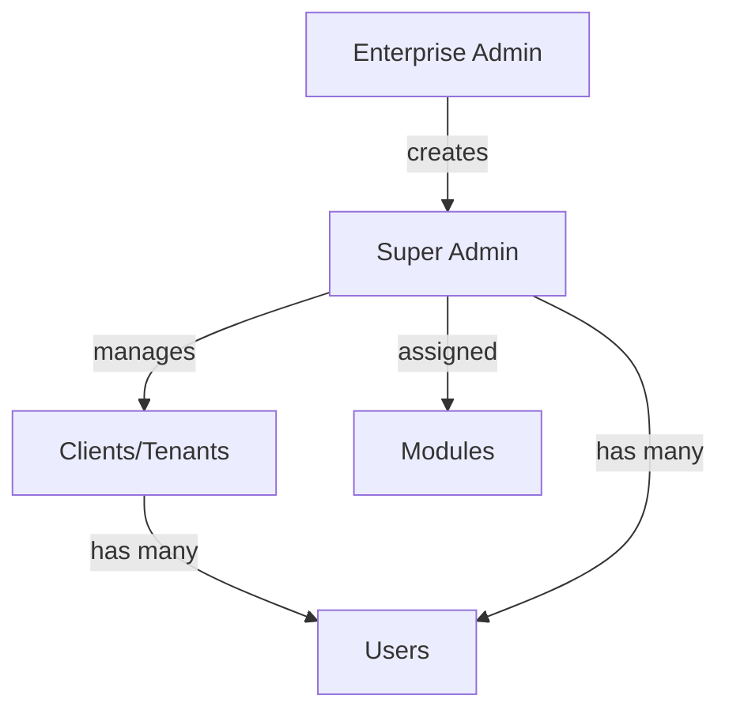

# 🎯 Railway Database Setup - Complete Guide

## Problem Solved ✅

**Error:** `The table public.enterprise_admins does not exist in the current database`  
**Cause:** Railway database was missing the multi-tenant tables required by Prisma  
**Solution:** Created all tables and seeded demo data

---

## What Was Done

### 1. Created Missing Tables ✅
- ✅ `enterprise_admins` - Platform administrators
- ✅ `super_admins` - Product-specific admins (Business/Pump ERP)
- ✅ `clients` - Tenant organizations
- ✅ `modules` - Available system modules
- ✅ `module_assignments` - Super admin module permissions
- ✅ `permissions` - Role-based access control

### 2. Updated Users Table ✅
Added missing columns:
- `productType` - PUMP_ERP | BUSINESS_ERP
- `tenant_id` - Link to client/tenant
- `super_admin_id` - Link to managing super admin
- `is_active` - Active status flag
- `assignedModules` - JSONB array of modules
- `pagePermissions` - JSONB permissions object
- `profile_pic_url` - Profile picture URL

### 3. Seeded Demo Data ✅
Created test accounts for all user types

---

## Demo Login Credentials

### 🏢 Enterprise Admin
- **Email:** `enterprise@bisman.erp`
- **Password:** `enterprise123`
- **Access:** Full platform control

### 👨‍💼 Business Super Admin
- **Email:** `business_superadmin@bisman.demo`
- **Password:** `Super@123`
- **Access:** Business ERP modules

### ⛽ Pump Super Admin
- **Email:** `pump_superadmin@bisman.demo`
- **Password:** `Super@123`
- **Access:** Petrol Pump ERP modules

### 🚚 Logistics Super Admin
- **Email:** `logistics_superadmin@bisman.demo`
- **Password:** `Super@123`
- **Access:** Logistics ERP modules

### 🏪 Hub Incharge (Demo User)
- **Email:** `demo_hub_incharge@bisman.demo`
- **Password:** `demo123`
- **Access:** Hub management modules

---

## Scripts Reference

### Create Tables
```bash
cat create-railway-tables.sql | railway connect bisman-erp-db
```

### Seed Data
```bash
cd my-backend
DATABASE_URL=$(railway variables --service bisman-erp-db | grep DATABASE_URL | cut -d'=' -f2-) \
  node seed-multi-tenant.js
```

### Verify Database
```bash
cat verify-railway-db.sql | railway connect bisman-erp-db
```

### Fix Schema Issues
```bash
cat fix-railway-db-schema.sql | railway connect bisman-erp-db
```

---

## Database Schema



### Table Relationships
```
enterprise_admins (1) ──→ (N) super_admins
super_admins (1) ──→ (N) clients
super_admins (1) ──→ (N) module_assignments
clients (1) ──→ (N) users
super_admins (1) ──→ (N) users
modules (1) ──→ (N) module_assignments
```

---

## Troubleshooting

### If Login Still Fails

1. **Check if tables exist:**
   ```sql
   SELECT table_name FROM information_schema.tables 
   WHERE table_schema='public' AND table_name LIKE '%admin%';
   ```

2. **Check if data exists:**
   ```sql
   SELECT COUNT(*) FROM enterprise_admins;
   SELECT COUNT(*) FROM super_admins;
   SELECT COUNT(*) FROM users;
   ```

3. **Re-run seeding:**
   ```bash
   cd my-backend
   DATABASE_URL="<railway-db-url>" node seed-multi-tenant.js
   ```

4. **Check backend logs:**
   ```bash
   railway logs --service bisman-erp-backend
   ```

---

## Next Steps

1. ✅ Test login at: https://bisman-erp-backend-production.up.railway.app
2. ✅ Verify all user types can login
3. ✅ Check module assignments work correctly
4. ✅ Test RBAC permissions

---

## Files Created

- `create-railway-tables.sql` - Creates all missing tables
- `fix-railway-db-schema.sql` - Fixes schema issues
- `verify-railway-db.sql` - Verification queries
- `insert-demo-user-railway.sql` - Insert single demo user
- `restore-full-db-to-railway.sh` - Full DB restore script
- `restore-db-to-railway.sh` - Basic restore helper

---

## Status: ✅ COMPLETE

The Railway database is now fully set up with:
- All required multi-tenant tables
- Proper foreign key relationships
- Demo user data
- Index optimizations
- RBAC permissions structure

**You can now login to your Railway-deployed application!** 🎉

---

**Last Updated:** 2025-11-14  
**Database:** Railway PostgreSQL  
**Environment:** Production
