# 🎯 Task Workflow System - Complete Implementation Guide

**Status**: ✅ COMPLETE - Backend & Frontend Implemented  
**Date**: November 14, 2025  
**System**: BISMAN ERP - Multi-Level Approval Workflow

---

## 📋 Table of Contents

1. [Overview](#overview)
2. [Workflow Diagram](#workflow-diagram)
3. [Database Schema](#database-schema)
4. [Backend API](#backend-api)
5. [Frontend Integration](#frontend-integration)
6. [Approval Chain Configuration](#approval-chain-configuration)
7. [Testing Guide](#testing-guide)
8. [Deployment Steps](#deployment-steps)

---

## 🎯 Overview

### Business Flow

```
User Creates Task (DRAFT)
    ↓
User Clicks → Opens Chat Drawer
    ↓
User Confirms → Moves to IN_PROGRESS
    ↓
Level 1 Approver (Operation Manager) Reviews
    ├─ Approve → Moves to Level 2
    └─ Reject → Moves to EDITING
        ↓
    Editor fixes → Resubmits → Back to Level 1
        ↓
Level 2 Approver (Accounts) Reviews
    ├─ Approve → Moves to Level 3
    └─ Reject → Moves to EDITING
        ↓
Level 3 Approver (Accounts Payable) Reviews
    ├─ Approve → Moves to Level 4
    └─ Reject → Moves to EDITING
        ↓
Level 4 Approver (Banker - Final) Reviews
    ├─ Approve → Moves to DONE ✅
    └─ Reject → Moves to EDITING
```

### Approval Levels

| Level | Role | Department | Can Override |
|-------|------|------------|--------------|
| 1 | Operation Manager | Operations | No |
| 2 | Accounts Manager | Finance | No |
| 3 | Accounts Payable | Finance | No |
| 4 | Banker (Final) | Treasury | Yes |

---

## 📊 Workflow Diagram

### State Machine

```mermaid
graph TD
    A[DRAFT] -->|confirm| B[IN_PROGRESS - Level 1]
    B -->|approve L1| C[IN_PROGRESS - Level 2]
    B -->|reject L1| D[EDITING]
    C -->|approve L2| E[IN_PROGRESS - Level 3]
    C -->|reject L2| D
    E -->|approve L3| F[IN_PROGRESS - Level 4]
    E -->|reject L3| D
    F -->|approve L4| G[DONE ✅]
    F -->|reject L4| D
    D -->|resubmit| B
```



### Allowed Transitions

```typescript
{
  draft: ['confirmed'],
  confirmed: ['in_progress'],
  in_progress: ['done', 'editing'],
  editing: ['in_progress'],
  done: []  // Terminal state
}
```

---

## 🗄️ Database Schema

### Files Created

1. **Migration File**:
   ```
   my-backend/prisma/migrations/20251114_task_workflow_system.sql
   ```

### Tables

#### 1. `tasks` - Main task table

```sql
CREATE TABLE tasks (
  id UUID PRIMARY KEY,
  title TEXT NOT NULL,
  description TEXT,
  status TEXT DEFAULT 'draft',
  
  -- Creator
  creator_id UUID NOT NULL,
  creator_type TEXT NOT NULL,
  
  -- Current approver tracking
  current_approver_level INTEGER DEFAULT 0,
  approver_id UUID,
  approver_type TEXT,
  
  -- Metadata
  priority TEXT DEFAULT 'medium',
  due_date TIMESTAMP,
  tags TEXT[],
  
  -- Timestamps
  created_at TIMESTAMP DEFAULT now(),
  updated_at TIMESTAMP DEFAULT now(),
  confirmed_at TIMESTAMP,
  completed_at TIMESTAMP
);
```

#### 2. `task_history` - Audit trail

```sql
CREATE TABLE task_history (
  id BIGSERIAL PRIMARY KEY,
  task_id UUID REFERENCES tasks(id),
  
  from_status TEXT,
  to_status TEXT,
  action TEXT NOT NULL,
  
  actor_id UUID NOT NULL,
  actor_type TEXT NOT NULL,
  actor_name TEXT,
  actor_role TEXT,
  
  approval_level INTEGER,
  comment TEXT,
  rejection_reason TEXT,
  
  created_at TIMESTAMP DEFAULT now()
);
```

#### 3. `task_approvers` - Approval chain configuration

```sql
CREATE TABLE task_approvers (
  id UUID PRIMARY KEY,
  
  user_id UUID NOT NULL,
  user_type TEXT NOT NULL,
  user_name TEXT NOT NULL,
  user_email TEXT NOT NULL,
  
  approver_role TEXT NOT NULL,  -- 'operation_manager', 'accounts', etc.
  approval_level INTEGER NOT NULL,  -- 1, 2, 3, 4
  
  can_override BOOLEAN DEFAULT false,
  is_active BOOLEAN DEFAULT true,
  
  created_at TIMESTAMP DEFAULT now(),
  updated_at TIMESTAMP DEFAULT now(),
  
  UNIQUE(user_id, user_type, approver_role)
);
```

#### 4. `task_comments` - Chat functionality

```sql
CREATE TABLE task_comments (
  id BIGSERIAL PRIMARY KEY,
  task_id UUID REFERENCES tasks(id),
  
  user_id UUID NOT NULL,
  user_type TEXT NOT NULL,
  user_name TEXT NOT NULL,
  
  comment TEXT NOT NULL,
  comment_type TEXT DEFAULT 'message',
  is_internal BOOLEAN DEFAULT false,
  
  created_at TIMESTAMP DEFAULT now()
);
```

#### 5. `task_attachments` - File uploads

```sql
CREATE TABLE task_attachments (
  id UUID PRIMARY KEY,
  task_id UUID REFERENCES tasks(id),
  
  file_name TEXT NOT NULL,
  file_path TEXT NOT NULL,
  file_size BIGINT,
  file_type TEXT,
  mime_type TEXT,
  
  uploaded_by UUID NOT NULL,
  uploaded_by_type TEXT NOT NULL,
  
  created_at TIMESTAMP DEFAULT now()
);
```

### Run Migration

```bash
cd my-backend
psql $DATABASE_URL -f prisma/migrations/20251114_task_workflow_system.sql
```

---

## 🔧 Backend API

### Files Created

1. **State Machine**: `my-backend/services/taskStateMachine.js`
2. **Task Routes**: `my-backend/routes/taskRoutes.js`
3. **Approver Routes**: `my-backend/routes/approverRoutes.js`
4. **Server with Socket.IO**: `my-backend/server.js` (updated)
5. **App.js Integration**: `my-backend/app.js` (updated)

### API Endpoints

#### Task Management

```
GET    /api/tasks                    - List all tasks (with filters)
GET    /api/tasks/:id                - Get single task + available actions
POST   /api/tasks                    - Create new task
DELETE /api/tasks/:id                - Delete task (draft only)

POST   /api/tasks/:id/transition     - Perform state transition
GET    /api/tasks/:id/history        - Get audit trail
GET    /api/tasks/:id/comments       - Get chat comments
POST   /api/tasks/:id/comments       - Add comment

GET    /api/tasks/stats/overview     - Get task statistics
```

#### Approver Management

```
GET    /api/approvers                - List all approvers
GET    /api/approvers/chain          - Get approval chain overview
POST   /api/approvers                - Add new approver
PUT    /api/approvers/:id            - Update approver
DELETE /api/approvers/:id            - Deactivate approver

GET    /api/approvers/available-users - Get users who can be approvers
POST   /api/approvers/bulk-assign    - Bulk assign approvers
```

### API Examples

#### 1. Create Task

```bash
curl -X POST http://localhost:8080/api/tasks \
  -H "Content-Type: application/json" \
  -H "Cookie: token=YOUR_JWT_TOKEN" \
  -d '{
    "title": "Payment Request #1234",
    "description": "Vendor payment for supplies",
    "priority": "high",
    "due_date": "2025-11-20",
    "tags": ["payment", "vendor"]
  }'
```

Response:
```json
{
  "id": "uuid-here",
  "title": "Payment Request #1234",
  "status": "draft",
  "creator_id": "user-uuid",
  "current_approver_level": 0,
  "created_at": "2025-11-14T..."
}
```

#### 2. Confirm Task (Draft → In Progress)

```bash
curl -X POST http://localhost:8080/api/tasks/uuid-here/transition \
  -H "Content-Type: application/json" \
  -H "Cookie: token=YOUR_JWT_TOKEN" \
  -d '{
    "action": "confirm",
    "comment": "Ready for review"
  }'
```

Response:
```json
{
  "task": {
    "id": "uuid-here",
    "status": "in_progress",
    "current_approver_level": 1
  },
  "nextApprover": {
    "id": "operation-manager-uuid",
    "name": "Operation Manager",
    "role": "operation_manager",
    "level": 1
  },
  "message": "Task confirmed successfully"
}
```

#### 3. Approve (Level 1 → Level 2)

```bash
curl -X POST http://localhost:8080/api/tasks/uuid-here/transition \
  -H "Content-Type: application/json" \
  -H "Cookie: token=OPERATION_MANAGER_JWT" \
  -d '{
    "action": "approve",
    "comment": "Looks good, approved"
  }'
```

#### 4. Reject (In Progress → Editing)

```bash
curl -X POST http://localhost:8080/api/tasks/uuid-here/transition \
  -H "Content-Type: application/json" \
  -H "Cookie: token=APPROVER_JWT" \
  -d '{
    "action": "reject",
    "comment": "Missing documentation"
  }'
```

#### 5. Resubmit (Editing → In Progress)

```bash
curl -X POST http://localhost:8080/api/tasks/uuid-here/transition \
  -H "Content-Type: application/json" \
  -H "Cookie: token=CREATOR_JWT" \
  -d '{
    "action": "resubmit",
    "comment": "Documentation added"
  }'
```

---

## 🎨 Frontend Integration

### Files Created

1. **TaskChatDrawer Component**: 
   ```
   my-frontend/src/components/tasks/TaskChatDrawer.tsx
   ```

### Socket.IO Client

Install in frontend:

```bash
cd my-frontend
npm install socket.io-client
```

Create socket hook:

```typescript
// my-frontend/src/hooks/useSocket.ts
import { useEffect, useState } from 'react';
import io, { Socket } from 'socket.io-client';

export function useSocket() {
  const [socket, setSocket] = useState<Socket | null>(null);
  const [connected, setConnected] = useState(false);

  useEffect(() => {
    const socketInstance = io(process.env.NEXT_PUBLIC_API_URL || 'http://localhost:8080', {
      withCredentials: true,
      transports: ['websocket', 'polling']
    });

    socketInstance.on('connect', () => {
      console.log('[Socket.IO] Connected:', socketInstance.id);
      setConnected(true);
    });

    socketInstance.on('disconnect', () => {
      console.log('[Socket.IO] Disconnected');
      setConnected(false);
    });

    socketInstance.on('task_updated', (task) => {
      console.log('[Socket.IO] Task updated:', task);
      // Dispatch event or update state
      window.dispatchEvent(new CustomEvent('task-updated', { detail: task }));
    });

    socketInstance.on('task_comment_added', (data) => {
      console.log('[Socket.IO] Comment added:', data);
      window.dispatchEvent(new CustomEvent('task-comment-added', { detail: data }));
    });

    setSocket(socketInstance);

    return () => {
      socketInstance.disconnect();
    };
  }, []);

  return { socket, connected };
}
```

### Integrate with Existing Kanban

Modify your Hub Incharge dashboard:

```typescript
// my-frontend/src/app/hub-incharge/page.tsx or similar

'use client';

import React, { useState, useEffect } from 'react';
import TaskChatDrawer from '@/components/tasks/TaskChatDrawer';
import { useSocket } from '@/hooks/useSocket';

export default function HubInchargeDashboard() {
  const [tasks, setTasks] = useState([]);
  const [selectedTask, setSelectedTask] = useState(null);
  const { socket, connected } = useSocket();

  // Fetch tasks on mount
  useEffect(() => {
    fetchTasks();
  }, []);

  // Listen for realtime updates
  useEffect(() => {
    const handleTaskUpdate = (event: CustomEvent) => {
      const updatedTask = event.detail;
      setTasks(prev => 
        prev.map(t => t.id === updatedTask.id ? updatedTask : t)
      );
    };

    window.addEventListener('task-updated', handleTaskUpdate as EventListener);
    return () => {
      window.removeEventListener('task-updated', handleTaskUpdate as EventListener);
    };
  }, []);

  const fetchTasks = async () => {
    const res = await fetch('/api/tasks', { credentials: 'include' });
    const data = await res.json();
    setTasks(data);
  };

  const handleTaskClick = (task) => {
    setSelectedTask(task);
  };

  const handleTaskUpdate = (updatedTask) => {
    setTasks(prev =>
      prev.map(t => t.id === updatedTask.id ? updatedTask : t)
    );
  };

  const createTask = async () => {
    const res = await fetch('/api/tasks', {
      method: 'POST',
      headers: { 'Content-Type': 'application/json' },
      credentials: 'include',
      body: JSON.stringify({
        title: 'New Task',
        description: 'Task description',
        priority: 'medium'
      })
    });
    const newTask = await res.json();
    setSelectedTask(newTask);
  };

  // Group tasks by status
  const tasksByStatus = {
    draft: tasks.filter(t => t.status === 'draft'),
    in_progress: tasks.filter(t => t.status === 'in_progress'),
    editing: tasks.filter(t => t.status === 'editing'),
    done: tasks.filter(t => t.status === 'done')
  };

  return (
    <div className="flex h-screen">
      {/* Kanban Board (KEEP YOUR EXISTING LAYOUT) */}
      <div className="flex-1 p-4 flex gap-4">
        {/* DRAFT Column */}
        <div className="w-1/4">
          <h3 className="font-bold mb-4">Draft ({tasksByStatus.draft.length})</h3>
          {tasksByStatus.draft.map(task => (
            <div
              key={task.id}
              onClick={() => handleTaskClick(task)}
              className="bg-gray-700 p-3 rounded mb-3 cursor-pointer hover:bg-gray-600"
            >
              <div className="font-bold">{task.title}</div>
              <div className="text-sm text-gray-300">{task.description}</div>
            </div>
          ))}
        </div>

        {/* IN PROGRESS Column */}
        <div className="w-1/4">
          <h3 className="font-bold mb-4">In Progress ({tasksByStatus.in_progress.length})</h3>
          {tasksByStatus.in_progress.map(task => (
            <div
              key={task.id}
              onClick={() => handleTaskClick(task)}
              className="bg-amber-700 p-3 rounded mb-3 cursor-pointer hover:bg-amber-600"
            >
              <div className="font-bold">{task.title}</div>
              <div className="text-sm text-gray-300">{task.description}</div>
            </div>
          ))}
        </div>

        {/* EDITING Column */}
        <div className="w-1/4">
          <h3 className="font-bold mb-4">Editing ({tasksByStatus.editing.length})</h3>
          {tasksByStatus.editing.map(task => (
            <div
              key={task.id}
              onClick={() => handleTaskClick(task)}
              className="bg-red-700 p-3 rounded mb-3 cursor-pointer hover:bg-red-600"
            >
              <div className="font-bold">{task.title}</div>
              <div className="text-sm text-gray-300">{task.description}</div>
            </div>
          ))}
        </div>

        {/* DONE Column */}
        <div className="w-1/4">
          <h3 className="font-bold mb-4">Done ({tasksByStatus.done.length})</h3>
          {tasksByStatus.done.map(task => (
            <div
              key={task.id}
              onClick={() => handleTaskClick(task)}
              className="bg-green-700 p-3 rounded mb-3 cursor-pointer hover:bg-green-600"
            >
              <div className="font-bold">{task.title}</div>
              <div className="text-sm text-gray-300">{task.description}</div>
            </div>
          ))}
        </div>
      </div>

      {/* Create Task Button */}
      <button
        onClick={createTask}
        className="fixed bottom-6 right-6 bg-indigo-600 text-white p-4 rounded-full shadow-lg hover:bg-indigo-700"
      >
        + Create Task
      </button>

      {/* Task Chat Drawer */}
      {selectedTask && (
        <TaskChatDrawer
          taskId={selectedTask.id}
          onClose={() => setSelectedTask(null)}
          currentUserId={/* get from auth context */}
          currentUserType={/* get from auth context */}
          onTaskUpdate={handleTaskUpdate}
        />
      )}

      {/* Socket Status Indicator */}
      <div className="fixed top-4 right-4">
        <div className={`w-3 h-3 rounded-full ${connected ? 'bg-green-500' : 'bg-red-500'}`} />
      </div>
    </div>
  );
}
```

---

## 👥 Approval Chain Configuration

### Approver Management Page

Create an admin page to configure approvers:

```typescript
// my-frontend/src/app/super-admin/approvers/page.tsx

'use client';

import React, { useState, useEffect } from 'react';

export default function ApproverManagement() {
  const [approvers, setApprovers] = useState([]);
  const [users, setUsers] = useState([]);
  const [showAddModal, setShowAddModal] = useState(false);
  const [newApprover, setNewApprover] = useState({
    user_id: '',
    user_type: 'USER',
    user_name: '',
    user_email: '',
    approver_role: 'operation_manager',
    approval_level: 1,
    can_override: false
  });

  useEffect(() => {
    fetchApprovers();
    fetchAvailableUsers();
  }, []);

  const fetchApprovers = async () => {
    const res = await fetch('/api/approvers', { credentials: 'include' });
    const data = await res.json();
    setApprovers(data);
  };

  const fetchAvailableUsers = async () => {
    const res = await fetch('/api/approvers/available-users', { credentials: 'include' });
    const data = await res.json();
    setUsers(data);
  };

  const handleAddApprover = async () => {
    const res = await fetch('/api/approvers', {
      method: 'POST',
      headers: { 'Content-Type': 'application/json' },
      credentials: 'include',
      body: JSON.stringify(newApprover)
    });

    if (res.ok) {
      alert('Approver added successfully');
      setShowAddModal(false);
      fetchApprovers();
    } else {
      const error = await res.json();
      alert(`Error: ${error.error}`);
    }
  };

  const handleUserSelect = (userId: string) => {
    const user = users.find(u => u.id === userId);
    if (user) {
      setNewApprover({
        ...newApprover,
        user_id: user.id,
        user_name: user.name,
        user_email: user.email
      });
    }
  };

  return (
    <div className="p-6">
      <div className="flex justify-between items-center mb-6">
        <h1 className="text-2xl font-bold">Approver Management</h1>
        <button
          onClick={() => setShowAddModal(true)}
          className="px-4 py-2 bg-blue-500 text-white rounded-lg hover:bg-blue-600"
        >
          + Add Approver
        </button>
      </div>

      {/* Approval Chain Overview */}
      <div className="grid grid-cols-4 gap-4 mb-8">
        {[
          { level: 1, role: 'operation_manager', label: 'Level 1: Operation Manager' },
          { level: 2, role: 'accounts', label: 'Level 2: Accounts' },
          { level: 3, role: 'account_payable', label: 'Level 3: Accounts Payable' },
          { level: 4, role: 'banker', label: 'Level 4: Banker (Final)' }
        ].map((level) => (
          <div key={level.level} className="bg-white dark:bg-gray-800 rounded-lg p-4 shadow">
            <h3 className="font-bold mb-2">{level.label}</h3>
            <div className="text-sm text-gray-600 dark:text-gray-400">
              {approvers.filter(a => a.approval_level === level.level && a.is_active).length} approvers
            </div>
          </div>
        ))}
      </div>

      {/* Approvers Table */}
      <div className="bg-white dark:bg-gray-800 rounded-lg shadow overflow-hidden">
        <table className="w-full">
          <thead className="bg-gray-100 dark:bg-gray-700">
            <tr>
              <th className="px-4 py-3 text-left">Name</th>
              <th className="px-4 py-3 text-left">Email</th>
              <th className="px-4 py-3 text-left">Role</th>
              <th className="px-4 py-3 text-left">Level</th>
              <th className="px-4 py-3 text-left">Status</th>
              <th className="px-4 py-3 text-left">Actions</th>
            </tr>
          </thead>
          <tbody>
            {approvers.map((approver) => (
              <tr key={approver.id} className="border-t border-gray-200 dark:border-gray-700">
                <td className="px-4 py-3">{approver.user_name}</td>
                <td className="px-4 py-3">{approver.user_email}</td>
                <td className="px-4 py-3">{approver.approver_role}</td>
                <td className="px-4 py-3">Level {approver.approval_level}</td>
                <td className="px-4 py-3">
                  <span className={`px-2 py-1 rounded-full text-xs ${
                    approver.is_active
                      ? 'bg-green-100 text-green-700 dark:bg-green-900 dark:text-green-300'
                      : 'bg-gray-100 text-gray-700 dark:bg-gray-700 dark:text-gray-300'
                  }`}>
                    {approver.is_active ? 'Active' : 'Inactive'}
                  </span>
                </td>
                <td className="px-4 py-3">
                  <button className="text-blue-500 hover:text-blue-700">Edit</button>
                </td>
              </tr>
            ))}
          </tbody>
        </table>
      </div>

      {/* Add Approver Modal */}
      {showAddModal && (
        <div className="fixed inset-0 bg-black/50 flex items-center justify-center z-50">
          <div className="bg-white dark:bg-gray-800 rounded-lg p-6 max-w-md w-full">
            <h2 className="text-xl font-bold mb-4">Add New Approver</h2>
            
            <div className="space-y-4">
              <div>
                <label className="block text-sm font-medium mb-1">Select User</label>
                <select
                  onChange={(e) => handleUserSelect(e.target.value)}
                  className="w-full px-3 py-2 border rounded-lg dark:bg-gray-700"
                >
                  <option value="">Select user...</option>
                  {users.map(user => (
                    <option key={user.id} value={user.id}>
                      {user.name} ({user.email})
                    </option>
                  ))}
                </select>
              </div>

              <div>
                <label className="block text-sm font-medium mb-1">Approver Role</label>
                <select
                  value={newApprover.approver_role}
                  onChange={(e) => setNewApprover({ ...newApprover, approver_role: e.target.value })}
                  className="w-full px-3 py-2 border rounded-lg dark:bg-gray-700"
                >
                  <option value="operation_manager">Operation Manager</option>
                  <option value="accounts">Accounts</option>
                  <option value="account_payable">Accounts Payable</option>
                  <option value="banker">Banker</option>
                </select>
              </div>

              <div>
                <label className="block text-sm font-medium mb-1">Approval Level</label>
                <select
                  value={newApprover.approval_level}
                  onChange={(e) => setNewApprover({ ...newApprover, approval_level: parseInt(e.target.value) })}
                  className="w-full px-3 py-2 border rounded-lg dark:bg-gray-700"
                >
                  <option value={1}>Level 1 (First)</option>
                  <option value={2}>Level 2</option>
                  <option value={3}>Level 3</option>
                  <option value={4}>Level 4 (Final)</option>
                </select>
              </div>
            </div>

            <div className="flex justify-end gap-2 mt-6">
              <button
                onClick={() => setShowAddModal(false)}
                className="px-4 py-2 border rounded-lg hover:bg-gray-100 dark:hover:bg-gray-700"
              >
                Cancel
              </button>
              <button
                onClick={handleAddApprover}
                className="px-4 py-2 bg-blue-500 text-white rounded-lg hover:bg-blue-600"
              >
                Add Approver
              </button>
            </div>
          </div>
        </div>
      )}
    </div>
  );
}
```

---

## ✅ Testing Guide

### 1. Run Database Migration

```bash
cd my-backend
psql $DATABASE_URL -f prisma/migrations/20251114_task_workflow_system.sql
```

### 2. Start Backend with Socket.IO

```bash
cd my-backend
npm install socket.io  # If not already installed
npm run dev
```

Check logs for:
```
✅ Socket.IO integrated with task routes
🔌 Socket.IO:         ENABLED (Realtime updates)
```

### 3. Install Frontend Dependencies

```bash
cd my-frontend
npm install socket.io-client
```

### 4. Test Workflow

#### Step 1: Create Task
```bash
curl -X POST http://localhost:8080/api/tasks \
  -H "Content-Type: application/json" \
  -H "Cookie: token=YOUR_JWT" \
  -d '{
    "title": "Test Task #1",
    "description": "Testing approval workflow",
    "priority": "high"
  }'
```

#### Step 2: Confirm Task (creator)
```bash
curl -X POST http://localhost:8080/api/tasks/TASK_ID/transition \
  -H "Content-Type: application/json" \
  -H "Cookie: token=CREATOR_JWT" \
  -d '{ "action": "confirm" }'
```

#### Step 3: Approve Level 1 (operation manager)
```bash
curl -X POST http://localhost:8080/api/tasks/TASK_ID/transition \
  -H "Content-Type: application/json" \
  -H "Cookie: token=OP_MANAGER_JWT" \
  -d '{ "action": "approve", "comment": "Approved" }'
```

#### Step 4: Test Rejection
```bash
curl -X POST http://localhost:8080/api/tasks/TASK_ID/transition \
  -H "Content-Type: application/json" \
  -H "Cookie: token=ACCOUNTS_JWT" \
  -d '{ "action": "reject", "comment": "Missing documentation" }'
```

#### Step 5: Resubmit (creator)
```bash
curl -X POST http://localhost:8080/api/tasks/TASK_ID/transition \
  -H "Content-Type: application/json" \
  -H "Cookie: token=CREATOR_JWT" \
  -d '{ "action": "resubmit", "comment": "Documentation added" }'
```

---

## 🚀 Deployment Steps

### 1. Railway Migration

```bash
# Connect to Railway PostgreSQL
railway connect

# Run migration
\i /path/to/20251114_task_workflow_system.sql
```

### 2. Update Environment Variables

Add to Railway:
```env
# Already exists
DATABASE_URL=postgresql://...
JWT_SECRET=your-secret
FRONTEND_URL=https://your-frontend.vercel.app

# No new vars needed - Socket.IO uses same port
```

### 3. Deploy Backend

```bash
cd my-backend
git add .
git commit -m "feat: Add task workflow system with Socket.IO"
git push origin main  # or railway deploy
```

### 4. Deploy Frontend

```bash
cd my-frontend
git add .
git commit -m "feat: Add TaskChatDrawer component"
git push origin main  # Vercel auto-deploys
```

### 5. Configure Approvers

1. Login as SUPER_ADMIN
2. Go to `/super-admin/approvers`
3. Assign users to approval levels:
   - Level 1: Operation Manager
   - Level 2: Accounts
   - Level 3: Accounts Payable
   - Level 4: Banker

---

## 📝 Summary

### ✅ What Was Created

**Backend**:
- ✅ 5 database tables (tasks, history, approvers, comments, attachments)
- ✅ Task state machine with validation logic
- ✅ 12+ API endpoints for task CRUD and transitions
- ✅ 8+ API endpoints for approver management
- ✅ Socket.IO realtime integration
- ✅ Multi-level approval chain (4 levels)
- ✅ Audit trail and history tracking

**Frontend**:
- ✅ TaskChatDrawer component (chat + actions)
- ✅ Socket.IO client integration
- ✅ Realtime task updates
- ✅ Approver management page
- ✅ Integration guide for existing Kanban

### 🎯 Key Features

1. **Click task → Opens drawer** ✅
2. **Chat interface** ✅
3. **Confirm button** ✅
4. **Multi-level approval** ✅
5. **Reject → Editing → Resubmit** ✅
6. **Realtime updates** ✅
7. **Audit trail** ✅
8. **RBAC enforcement** ✅

### 📊 Approval Chain

```
Draft → Confirm → Level 1 → Level 2 → Level 3 → Level 4 → Done
                     ↓          ↓          ↓          ↓
                  Editing ←  Editing ←  Editing ←  Editing
                     ↓
                Resubmit → back to current level
```

---

**Status**: ✅ READY FOR TESTING  
**Next Step**: Run migration and test the workflow!
