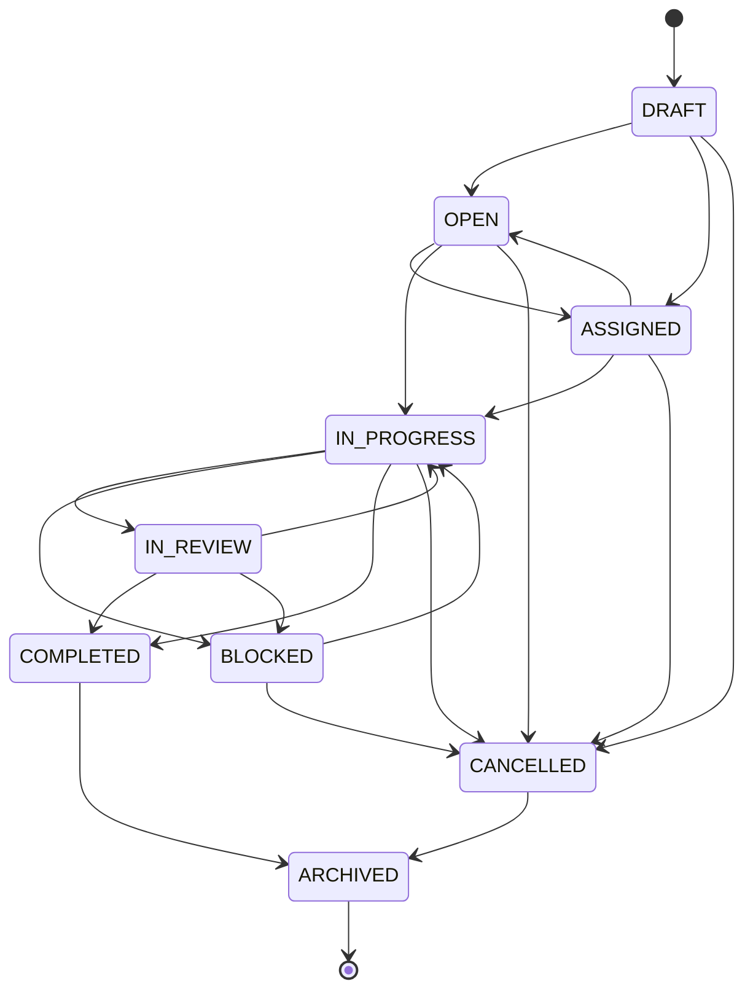

# Task Workflow Status Transitions

This document describes the allowed status transitions for tasks in the BISMAN ERP workflow system.

## Task Statuses

| Status | Description |
|--------|-------------|
| `DRAFT` | Task is being prepared, not yet visible to team |
| `OPEN` | Task is created and visible, not yet assigned |
| `ASSIGNED` | Task has been assigned to a user |
| `IN_PROGRESS` | Work has started on the task |
| `IN_REVIEW` | Task is completed, pending review |
| `BLOCKED` | Task is blocked by an external dependency |
| `COMPLETED` | Task has been completed and approved |
| `CANCELLED` | Task has been cancelled |
| `ARCHIVED` | Task is archived (historical record) |

## Allowed Transitions

```
DRAFT → OPEN, ASSIGNED, CANCELLED
OPEN → ASSIGNED, IN_PROGRESS, CANCELLED
ASSIGNED → IN_PROGRESS, CANCELLED, OPEN
IN_PROGRESS → IN_REVIEW, BLOCKED, COMPLETED, CANCELLED
IN_REVIEW → IN_PROGRESS, COMPLETED, BLOCKED
BLOCKED → IN_PROGRESS, CANCELLED
COMPLETED → ARCHIVED
CANCELLED → ARCHIVED
ARCHIVED → (no transitions allowed)

# Legacy status aliases (for backward compatibility):
TODO → ASSIGNED, IN_PROGRESS, CANCELLED (same as OPEN)
PENDING → ASSIGNED, IN_PROGRESS, CANCELLED (same as OPEN)
DONE → ARCHIVED (same as COMPLETED)
```

## Transition Diagram



## Permission Rules

- **Complete Task**: Only the **assignee** can mark a task as `COMPLETED`
- **Cancel Task**: Only the **creator** can mark a task as `CANCELLED`
- **Other Transitions**: Any authorized user with task edit permissions

## API Usage

### Change Task Status

```http
PATCH /api/v2/tasks/:taskId/status
Content-Type: application/json
Authorization: Bearer <token>

{
  "status": "IN_PROGRESS",
  "reason": "Starting work on this task"  // optional
}
```

### Successful Response (200)

```json
{
  "success": true,
  "data": {
    "id": 123,
    "status": "IN_PROGRESS",
    "updated_at": "2025-12-11T10:00:00.000Z"
  }
}
```

### Invalid Transition Response (409)

```json
{
  "success": false,
  "error": "Invalid status transition",
  "message": "Cannot change status from \"DRAFT\" to \"COMPLETED\". Allowed transitions from DRAFT: OPEN, ASSIGNED, CANCELLED",
  "currentStatus": "DRAFT",
  "requestedStatus": "COMPLETED",
  "allowedTransitions": ["OPEN", "ASSIGNED", "CANCELLED"],
  "hint": "See API docs for workflow transition rules"
}
```

### Permission Denied Response (403)

```json
{
  "success": false,
  "error": "Only the assignee can mark the task as completed"
}
```

## Notes

- Status values are case-insensitive in API requests (normalized to uppercase internally)
- All status changes are logged in the task message history as system messages
- Status changes trigger Socket.IO events for real-time updates
- Audit logs capture all status transitions with before/after values
